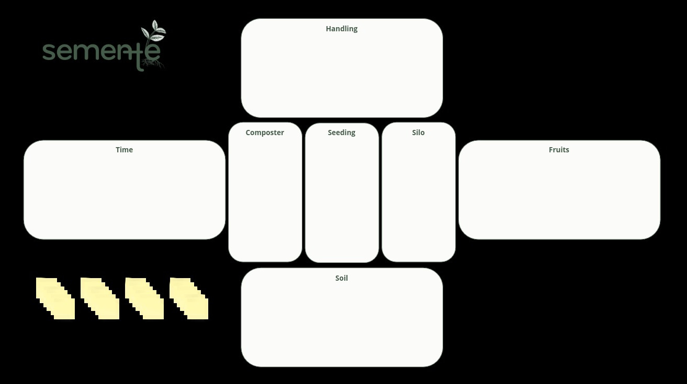
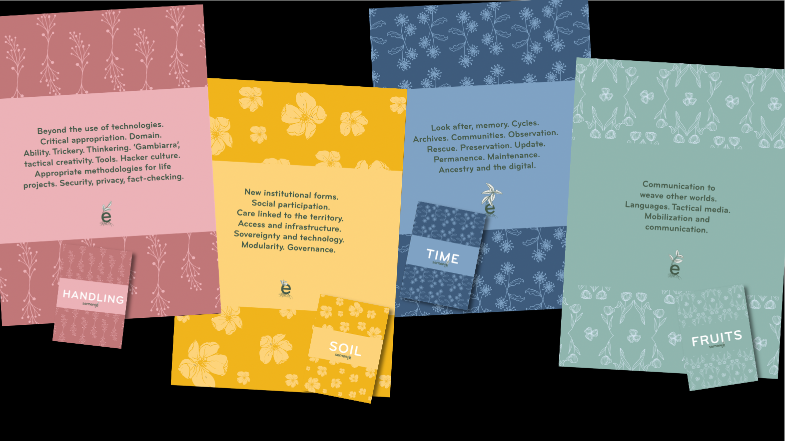

# semente canvas

**[semente](https://semente.de)** is a toolkit in the making to co-create community-based digital initiatives. It is informed by decades of digital rights activism in Brazil and the intention to regenerate fair and inclusive futures with the critical appropriation of digital technologies. semente is based on a canvas to help identify and dynamically shape the intentions and desires of a particular community around project ideas.

In its current version (November), the semente canvas/board has 4 macro areas: soil, handling, time and fruits. The core of the canvas has another three areas: composter, seeding and silo.

The november 2023 version of the semente canvas is available as a PDF [here](2023-11_canvas.pdf).

The semente canvas was designed by Bernardo van de Schepop, Felipe Schmidt Fonseca and Instituto Neos with support from the University of Bristol.

